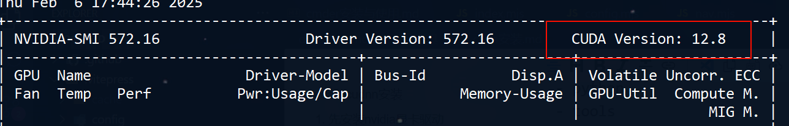
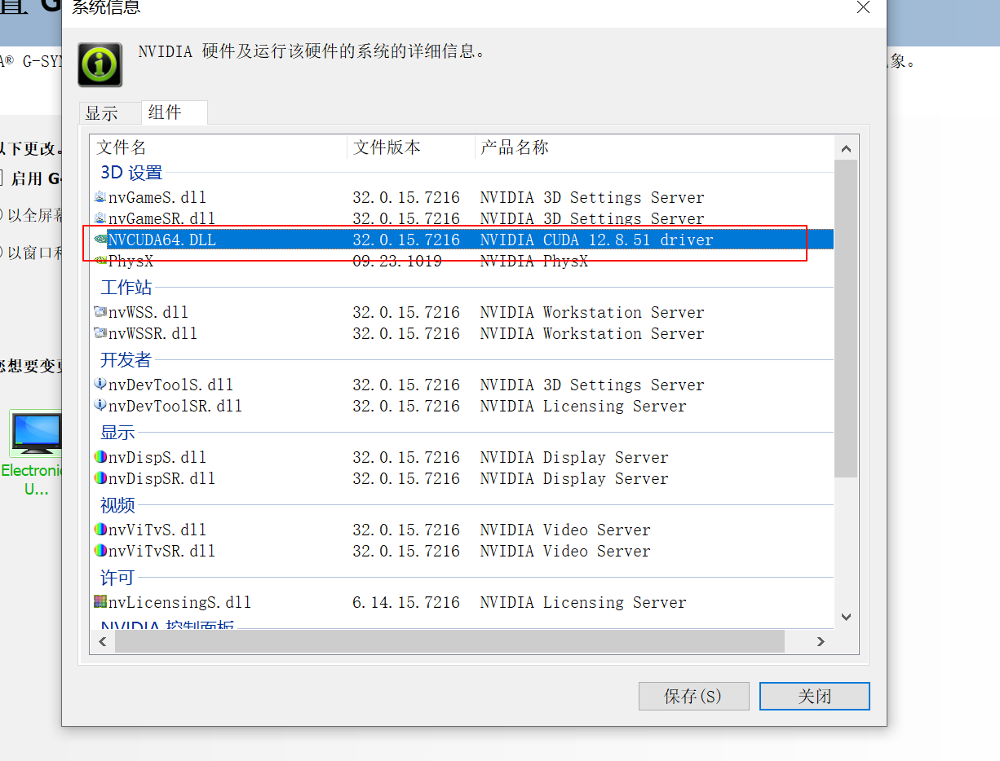
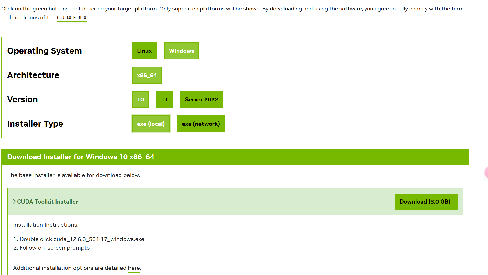
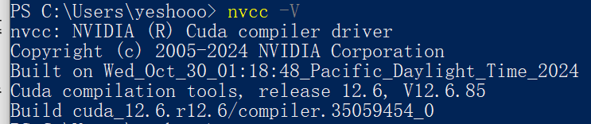
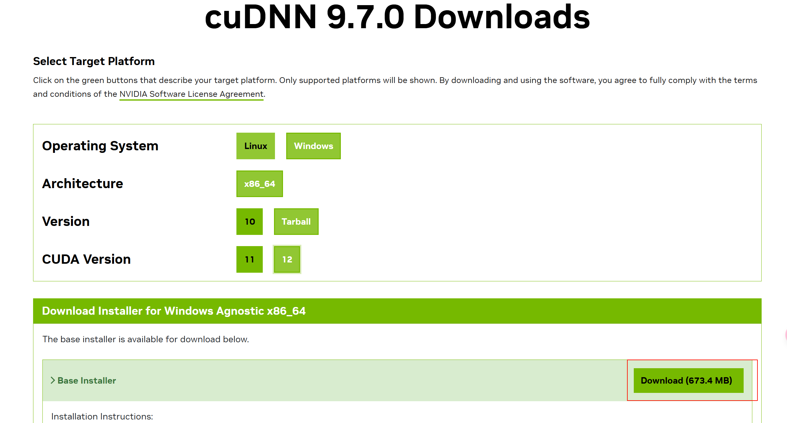
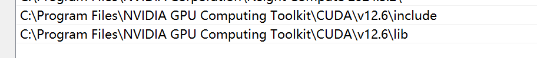
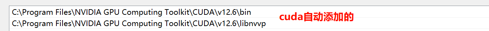
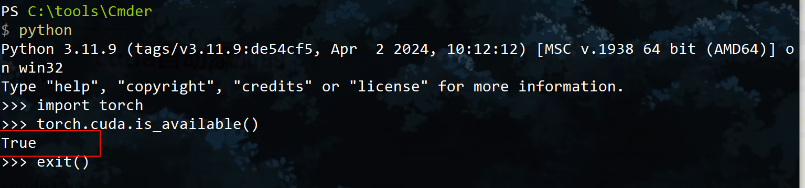

# pytorch安装

## 1. 先安装nvidia显卡驱动

去[驱动下载页](https://www.nvidia.com/en-us/drivers/)根据自己电脑下载安装对应版本的驱动

安装完成后在命令行输入 `nvidia-smi`查看自己显卡支持的最大版本号cuda



或者打开nvida控制面板点击左下角系统信息--组件查看cuda选项



## 2. 安装CUDA Toolkit

去[英伟达cuda toolkit仓库](https://developer.nvidia.com/cuda-toolkit-archive)下载小于等于第一步支持的版本号的cuda，我这里下载的12.6.3



安装的时候直接一路确定下一步就行，他会覆盖掉第一步安装的驱动

安装完成后会自动添加 `CUDA_PATH`和 `CUDA_PATH_V12_6`两个环境变量，如果没自动添加的话，自己手动添加一下，其他 `NVCUDASAMPLES_ROOT`根据自己需要手动添加，如果不知道是啥，就直接略过就行了。

输入 `nvcc -V`验证是否安装成功



## 3 cuDNN安装

这里下载的时候可能要你注册nvida账号，自行注册即可

去[cudnn 官方下载页](https://developer.nvidia.com/cudnn-archive)下载适合自己cuda版本的安装包，我这里下载的最新版9.7.0



这里下载tarball压缩包版本，下载完后将三个文件夹直接复制到cuda的安装目录 `C:\Program Files\NVIDIA GPU Computing Toolkit\CUDA\v12.6`，windows会自动合并两个目录种的内容

然后在path中添加这几个cuda路径(不作c++开发环境的话不用配，cuda已经默认添加了bin和libnvvp)

```shell
C:\Program Files\NVIDIA GPU Computing Toolkit\CUDA\v12.6\include
C:\Program Files\NVIDIA GPU Computing Toolkit\CUDA\v12.6\lib
C:\Program Files\NVIDIA GPU Computing Toolkit\CUDA\v12.6\bin
C:\Program Files\NVIDIA GPU Computing Toolkit\CUDA\v12.6\libnvvp
```





## 4. pytorch安装

去[pytorch官网](https://pytorch.org/get-started/locally/)选择对应的版本和安装方式生成安装命令，我这里选择的是pip+cuda12.6

```shell
pip3 install torch torchvision torchaudio --index-url https://download.pytorch.org/whl/cu126
```

**验证torch是否安装成功**

命令行打开 `python`解释器依次输入下列代码，看输出结果是否为 `true`

```python
import torch
torch.cuda.is_available()
```


