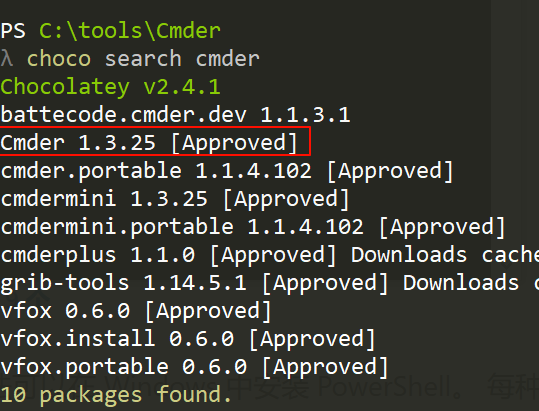
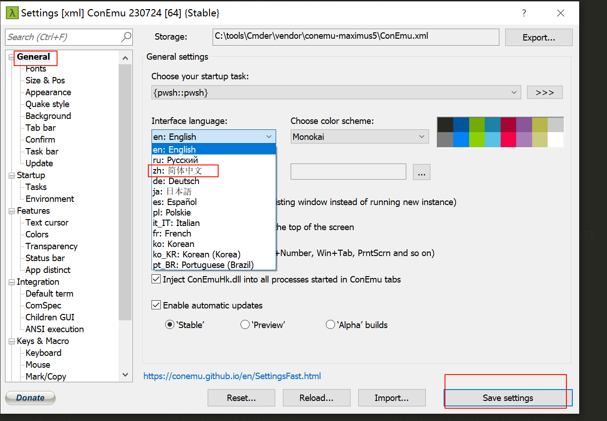
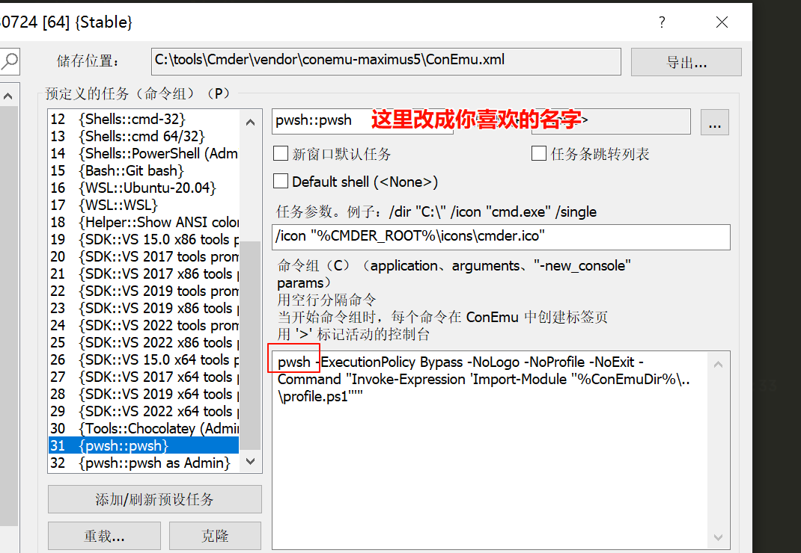
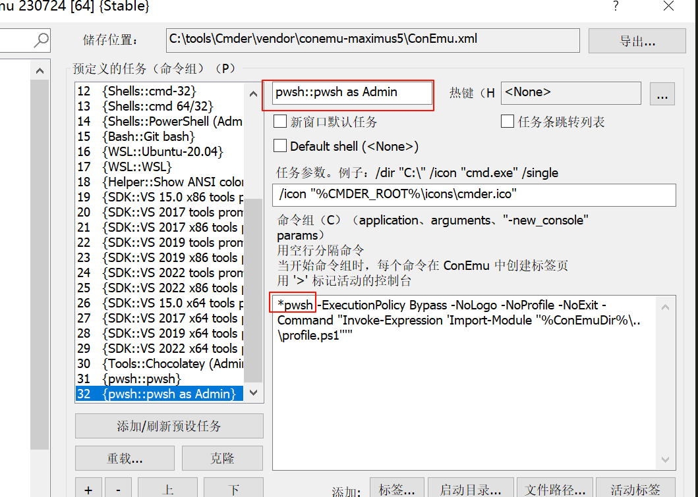
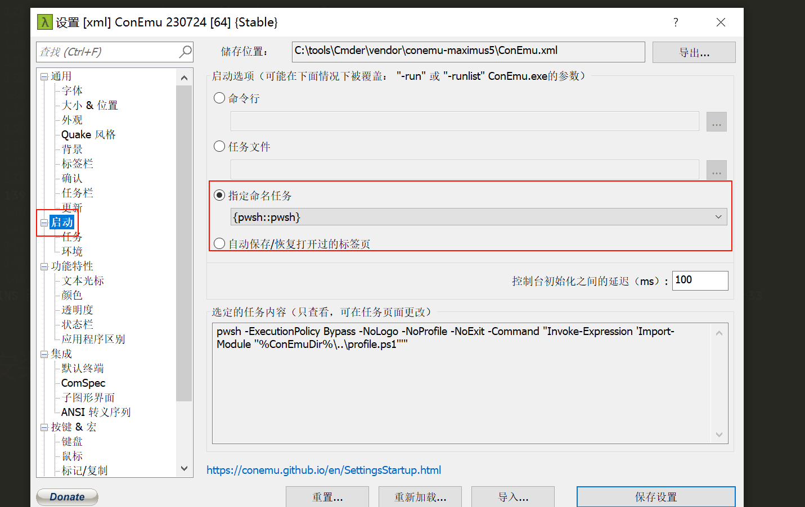
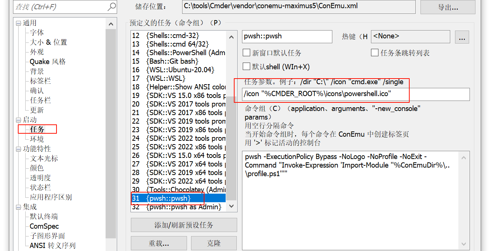
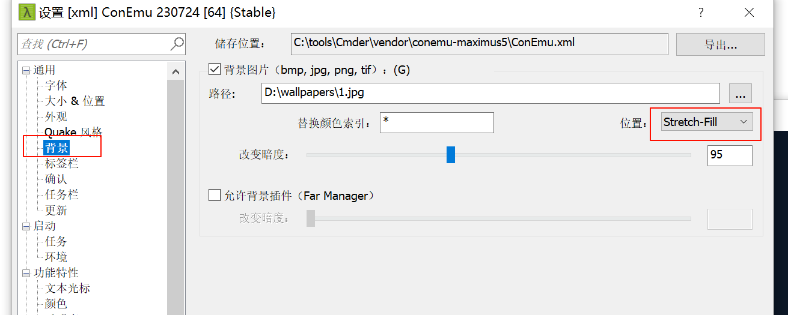

# cmder 安装与使用

前排送杠精：

windows 下也有 alacritty/wezterm 等更现代的终端模拟器，Windows Terminal 更现代等等等等吧

答：你个大聪明都知道我能不知道吗，cmder 是为了尽量抹平平台间的命令差异，不是为了装大聪明，让你配主题玩的。

## 安装

[不知道 choco 命令哪里来的看这里](/tools/windows/Chocolatey安装与使用)

```powershell
choco search cmder
```



[安装完整版](https://cmder.app/)

命令行启动 powershell 或者 pwsh

```powershell
choco install Cmder
```

==这里会自动添加到环境变量==

**注册到右键菜单**

管理员身份运行 powershell 或者 cmd

```powershell
Cmder.exe /REGISTER ALL
```

## 使用

### 改成汉语先

点击右下角的三条杠 | settings | General | Interface language | 改成中文 | 然后保存



### 添加 powershell core 和它的管理员模式，并且把默认启动改为 powershell core

点击设置 | 启动下的任务 | 分别克隆一份 PowerShell::PowerShell as Admin 和 PowerShell::PowerShell | 然后名字改成你喜欢的，并把命令中的 PowerShell 改为 pwsh

如：





### 设置默认启动为 powershell core

选择上一步刚设置的即可



### 修改默认的命令提示符 `λ`

**cmd 的**

网上的方法已经过时了，当前版本配置文件已经改了

修改 `C:\tools\Cmder\config\cmder_prompt_config.lua 中的第22行`

```lua
prompt_lambSymbol = "$"
```

**powershell/pwsh 的**

修改 `C:\tools\Cmder\vendor\profile.ps1`中第 111 行为

```powershell
Microsoft.PowerShell.Utility\Write-Host "`n$" -NoNewLine -ForegroundColor "DarkGray"
```

[扩展你可能有用的其他的](https://stackoverflow.com/questions/68283663/how-to-get-the-lambda-symbol-in-cmder-powershell-with-posh-git-after-the-git-i)

### 添加 git 支持

```shell
Install-Module posh-git
```

### 给 cmder 也配置系统代理

上面的启动任务得知，cmder 在启动 powershell desktop 和 pwsh 的时候，都是读的 cmder 自定义的配置文件 `C:\tools\Cmder\vendor\profile.ps1`，这里需要将代理相关的配置写入到此文件中

```powershell
# 添加到C:\tools\Cmder\vendor\profile.ps1 文件底部
$global:proxyUrl = "http://127.0.0.1:10808"

function Enable-Proxy {
    [System.Environment]::SetEnvironmentVariable("http_proxy", $global:proxyUrl, [System.EnvironmentVariableTarget]::Process)
    [System.Environment]::SetEnvironmentVariable("https_proxy", $global:proxyUrl, [System.EnvironmentVariableTarget]::Process)
    Write-Host "proxyON: $global:proxyUrl" -ForegroundColor Green
}

function Disable-Proxy {
    [System.Environment]::SetEnvironmentVariable("http_proxy", $null, [System.EnvironmentVariableTarget]::Process)
    [System.Environment]::SetEnvironmentVariable("https_proxy", $null, [System.EnvironmentVariableTarget]::Process)
    Write-Host "proxyOFF" -ForegroundColor Yellow
}

# 创建别名使用更简短的命令
Set-Alias -Name proxyhttp -Value Enable-Proxy
Set-Alias -Name unproxyhttp -Value Disable-Proxy

# 可选：添加一个查看当前代理状态的函数
function Get-ProxyStatus {
    $httpProxy = [System.Environment]::GetEnvironmentVariable("http_proxy", [System.EnvironmentVariableTarget]::Process)
    $httpsProxy = [System.Environment]::GetEnvironmentVariable("https_proxy", [System.EnvironmentVariableTarget]::Process)

    if ($httpProxy -or $httpsProxy) {
        Write-Host "Proxy Status:" -ForegroundColor Cyan
        Write-Host "HTTP Proxy: $httpProxy"
        Write-Host "HTTPS Proxy: $httpsProxy"
    } else {
        Write-Host "Proxy OFF" -ForegroundColor Gray
    }
}

Set-Alias -Name proxystat -Value Get-ProxyStatus
```

### 美化

##### **修改默认图标**

去找喜欢的图标，如去[iconfont](https://www.iconfont.cn/search/index?searchType=icon&q=powershell)下载 svg 后，使用[在线转换工具](https://convertio.co/zh/),将 svg 转成 ico，再放入 `C:\tools\Cmder\icons`目录下，然后

修改对应任务中的图标即可



##### 设置背景图片

注意这里的位置要改成填充模式，他就会自适应大小



其他

略，按自己心情配其他就好了，不关键
