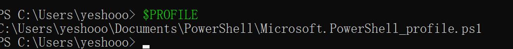

# powershell core 安装及代理配置

防杠指南：

1. 为什么安装 powershell 而不是默认的 powershell desktop？

[省流，powershell 更吊，更好用](https://learn.microsoft.com/zh-cn/powershell/scripting/whats-new/differences-from-windows-powershell?view=powershell-7.4)

2. 为什么不给 cmd 配系统代理

答： 也可以，同理，但是我懒，我不想写，而且 cmd 你可以临时开启,没必要整这么花里胡哨

::: code-group

```http
set http_proxy=http://127.0.0.1:10809
```

```https
set https_proxy=http://127.0.0.1:10809
```

:::

3. 什么是系统代理，为啥要给 powershell 配这玩意

答：自己去搜一下哈，你可别再懒死算了，省流就是你懂的

## 安装 powershell core

[官方文档其他安装方式](https://learn.microsoft.com/zh-cn/powershell/scripting/install/installing-powershell-on-windows?view=powershell-7.5)

这里直接使用官方推荐的安装方式，管理员模式打开 powershell

```powershell
winget install --id Microsoft.PowerShell --source winget
```

## 代理配置

为什么不直接使用 tun 模式？

答：你大概配不明白 dns，也不知道咋没速度，我是可以的，但是这里走系统代理是为了方便，不是为了为什么。

### 查看 poweshell 和 powershell core 的配置文件所在目录

分别运行 powershell 和 pwsh 命令，打开 powershell desktop 和 powershell core


输入 `$PROFILE`命令查看各自配置文件路径, 可知两者配置文件名均为 `Microsoft.PowerShell_profile.ps1`,所在目录分别为：

**powershell desktop**


即

```powershell
%USERPROFILE%\Documents\WindowsPowerShell\
```

**powershell core**



```powershell
%USERPROFILE%\Documents\PowerShell\
```

### 添加系统代理配置

将下列配置文件均贴到对应的.ps1 文件中,其中端口号为对应代理软件端口号

```powershell
$global:proxyUrl = "http://127.0.0.1:10808"

function Enable-Proxy {
    [System.Environment]::SetEnvironmentVariable("http_proxy", $global:proxyUrl, [System.EnvironmentVariableTarget]::Process)
    [System.Environment]::SetEnvironmentVariable("https_proxy", $global:proxyUrl, [System.EnvironmentVariableTarget]::Process)
    Write-Host "proxyON: $global:proxyUrl" -ForegroundColor Green
}

function Disable-Proxy {
    [System.Environment]::SetEnvironmentVariable("http_proxy", $null, [System.EnvironmentVariableTarget]::Process)
    [System.Environment]::SetEnvironmentVariable("https_proxy", $null, [System.EnvironmentVariableTarget]::Process)
    Write-Host "proxyOFF" -ForegroundColor Yellow
}

# 创建别名使用更简短的命令
Set-Alias -Name proxyhttp -Value Enable-Proxy
Set-Alias -Name unproxyhttp -Value Disable-Proxy

# 可选：添加一个查看当前代理状态的函数
function Get-ProxyStatus {
    $httpProxy = [System.Environment]::GetEnvironmentVariable("http_proxy", [System.EnvironmentVariableTarget]::Process)
    $httpsProxy = [System.Environment]::GetEnvironmentVariable("https_proxy", [System.EnvironmentVariableTarget]::Process)

    if ($httpProxy -or $httpsProxy) {
        Write-Host "Proxy Status:" -ForegroundColor Cyan
        Write-Host "HTTP Proxy: $httpProxy"
        Write-Host "HTTPS Proxy: $httpsProxy"
    } else {
        Write-Host "Proxy OFF" -ForegroundColor Gray
    }
}

Set-Alias -Name proxystat -Value Get-ProxyStatus
```

使用

在 powershell/pwsh 中使用命令之前，使用对应命令开关代理即可

```powershell
# 开启代理
proxyhttp
# 关闭代理
unproxyhttp
# 查看代理状态
proxystat

```
